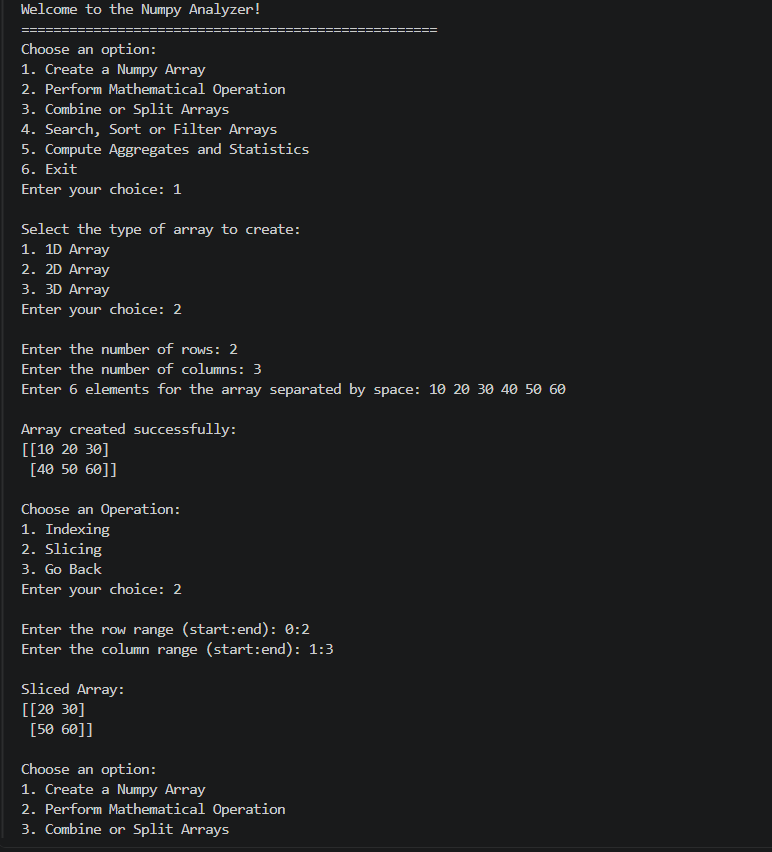
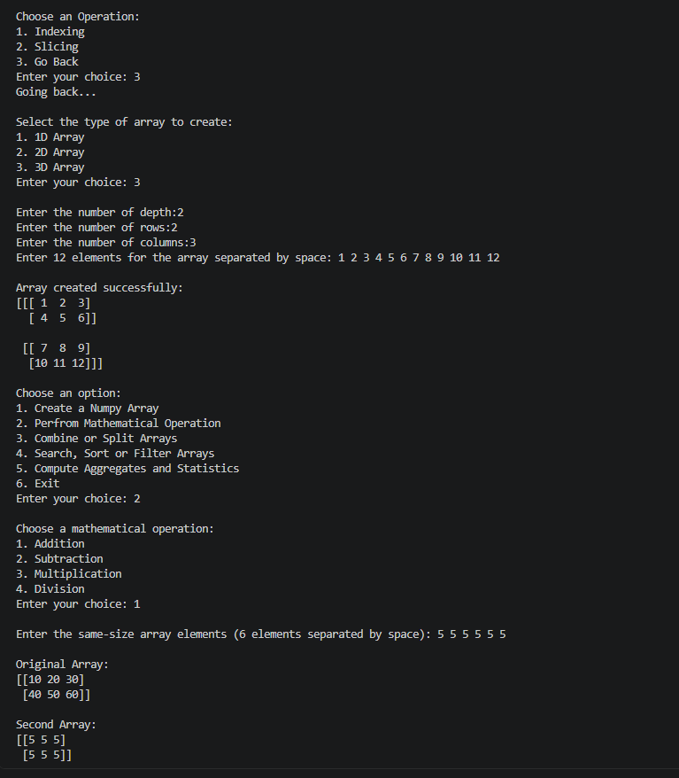
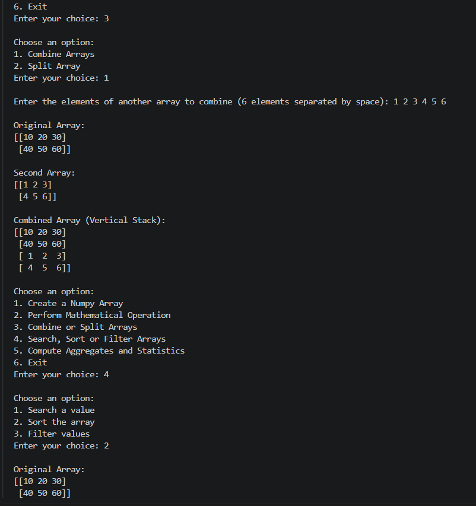
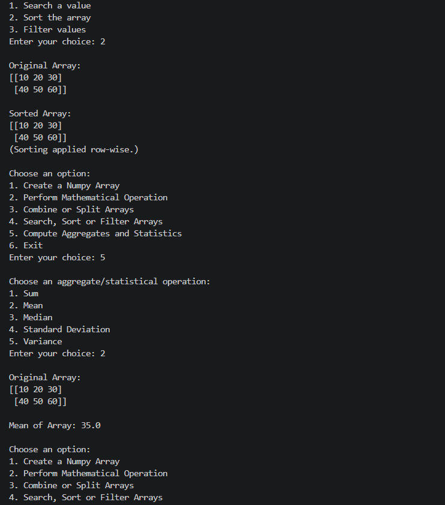
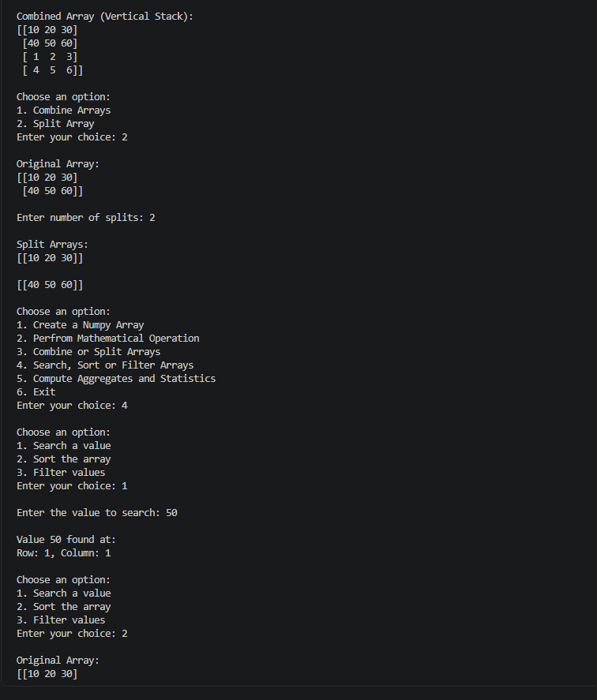
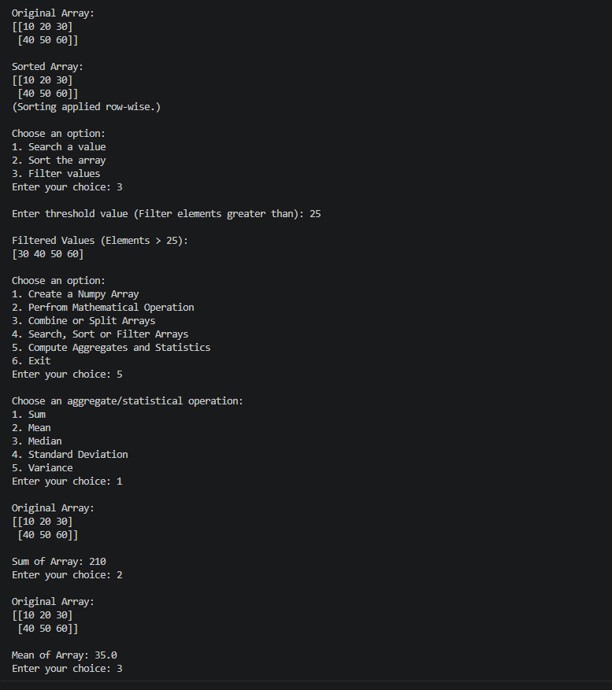
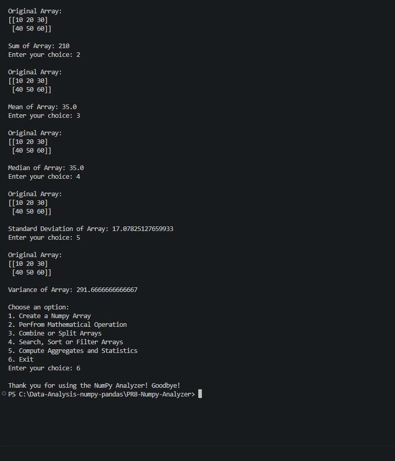

# PR8 - NumPy Analyzer

A simple **menu-driven Python application** built using **NumPy** and **Object-Oriented Programming (OOP)** concepts.

The project allows users to create and perform different operations on **1D, 2D, and 3D NumPy arrays** through an easy-to-use console menu.

---
## ✨ Features

### 1. Create a NumPy Array

* Create **1D, 2D, and 3D arrays**.
* Perform **indexing** to access specific elements.
* Perform **slicing** to extract a specific portion of a 2D array.

### 2. Mathematical Operations

* Perform **Addition, Subtraction, Multiplication, and Division** between two arrays.
* Includes a **division-by-zero check** to handle invalid division safely.

### 3. Combine or Split Arrays

* Combine two arrays using **vertical stacking (`vstack`)**.
* Split a 2D array into multiple parts using **vertical splitting (`vsplit`)**.

### 4. Search, Sort and Filter

* Search for a specific value and find its **row and column position**.
* Sort array elements using NumPy sorting.
* Filter and display elements based on a given **threshold value**.

### 5. Aggregates and Statistics

* Calculate **Sum** and **Mean** of the array.
* Find **Median**.
* Calculate **Standard Deviation** and **Variance**.
* These operations help to understand the basic statistical properties of the array.

---

### 🧠 Concepts Used

*  **Core Python:** `match-case` control flow, Exception handling (`try-except`)
*  **OOP Principles:** Classes & Objects, Encapsulation, `__init__` constructor
*  **Method Types:** Instance, Class (`@classmethod`), Static (`@staticmethod`), & Private helpers
*  **NumPy Multi-D Arrays:** 1D, 2D, and 3D array creation & structure
*  **Array Manipulation:** Indexing, slicing, combining & splitting
*  **Data & Math Ops:**  searching, sorting, filtering & aggregations

---

## 🛠️ Technologies Used

* **Python**
* **NumPy**
* **Object-Oriented Programming**


---
## 📂 Project Structure

```text
PR8-NumPy-Analyzer/
│
├── main.py
└── README.md
└── Screenshot

```

## ⚙️ Installation

Install NumPy using:

```bash
pip install numpy
```

## ▶️ How to Run

Open the project folder in VS Code and run:

```bash
python main.py
```

The program displays the following main menu:

```text
1. Create a Numpy Array
2. Perform Mathematical Operation
3. Combine or Split Arrays
4. Search, Sort or Filter Arrays
5. Compute Aggregates and Statistics
6. Exit
```

Select an option and follow the instructions shown in the terminal.

---

## 🔄 Program Flow

```text
Start
  ↓
Create DataAnalytics Object
  ↓
Display Main Menu
  ↓
Select Operation
  ↓
Perform NumPy Operation
  ↓
Display Result
  ↓
Return to Main Menu
  ↓
Exit
```

## 🎥 Project Demo Video

**Video Link:**
video Link:[https://drive.google.com/file/d/1Id44KOIxB4nqVOJC_tz8DcHfbfcXTxwI/view?usp=sharing]

---

## 📸 Output Screenshots








---

## 🎯 Learning Outcomes

This project provides practical experience with:

* NumPy arrays and multidimensional arrays
* Indexing and slicing
* Mathematical array operations
* Array combining and splitting
* Searching, sorting, and filtering
* Aggregate and statistical functions
* Object-Oriented Programming
* Exception handling
* Menu-driven Python applications
